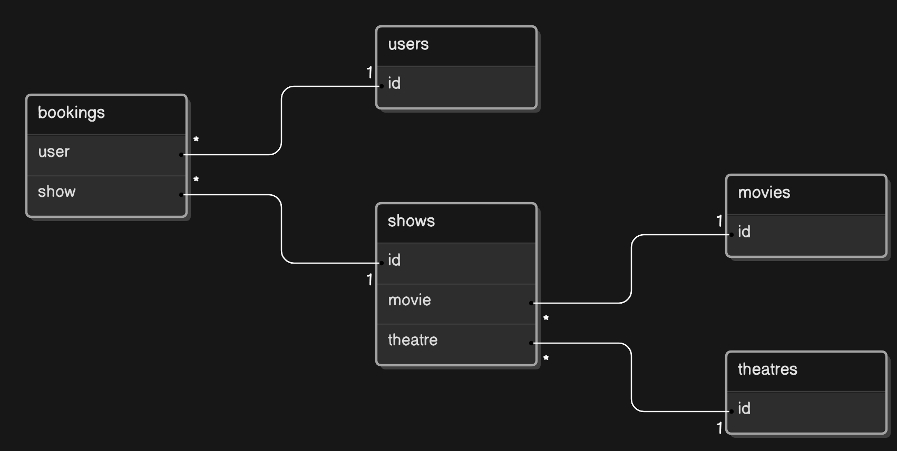

### Table of Contents

- [What this does?](#what-this-does)
- [Interface](#interface)
- [Relational Diagram](#relational-diagram)
- [Built With](#built-with)

## What this does?

This API is designed to manage a movie theater booking system, allowing users to browse movies, view showtimes, book seats, and manage their bookings. It includes authentication for users and admins, enabling secure operations such as adding new movies, creating shows, managing theaters, and processing bookings. The API integrates with Stripe for payment processing and ensures data consistency by updating available seats after each booking. It provides comprehensive endpoints for retrieving information about movies, theaters, shows, and user-specific bookings, supporting a seamless moviegoing experience.

## Interface

<table>
  <tr>
    <th>Name & Description</th>
    <th>HTTP Method</th>
    <th style="width:18%">Data Types</th>
    <th style="width:32%">Exceptions</th>
  </tr>
  <tr>
    <td>
      <code>auth/register</code>  
      Create a new account for a user given their name, email, and password. The password is securely hashed before being stored.
    </td>
    <td style="font-weight: bold; color: blue;">POST</td>
    <td>
      <b>Body Parameters:</b> 
      <code>( name, email, password )</code>  
      <b>Return type if no error:</b> 
      <code>201 Created</code>
    </td>
    <td>
      <b>400 Error</b> when:
      <ul>
        <li>Any of the fields (name, email, password) are missing</li>
        <li>The email is already associated with an existing user</li>
      </ul>
      <b>500 Error</b> when:
      <ul>
        <li>There is a server error during user creation</li>
      </ul>
    </td>
  </tr>
  <tr>
    <td>
      <code>auth/login</code>  
      Authenticate a user with their email and password, returning a JSON Web Token (JWT) if successful.
    </td>
    <td style="font-weight: bold; color: blue;">POST</td>
    <td>
      <b>Body Parameters:</b> 
      <code>( email, password )</code>  
      <b>Return type if no error:</b> 
      <code>{ token }</code>
    </td>
    <td>
      <b>400 Error</b> when:
      <ul>
        <li>The email does not belong to any registered user</li>
        <li>The password is incorrect</li>
      </ul>
      <b>500 Error</b> when:
      <ul>
        <li>There is a server error during the login process</li>
      </ul>
    </td>
  </tr>

  <tr>
    <td>
      <code>user/</code>  
      Retrieve the details of the currently authenticated user by their user ID. The request must be made by an admin.
    </td>
    <td style="font-weight: bold; color: blue;">GET</td>
    <td>
      <b>Header:</b> 
      <code>{ Authorization: Bearer token }</code>  
      <b>Return type if no error:</b> 
      <code>{ user }</code>
    </td>
    <td>
      <b>401 Error</b> when:
      <ul>
        <li>The user is not authenticated or the token is missing/invalid</li>
      </ul>
      <b>403 Error</b> when:
      <ul>
        <li>The user is not an admin</li>
      </ul>
      <b>500 Error</b> when:
      <ul>
        <li>There is a server error while retrieving user details</li>
      </ul>
    </td>
  </tr>
  <tr>
    <td>
      <code>user/:id/bookings</code>  
      List all bookings made by a user, identified by their user ID. This endpoint is authenticated and returns booking details, including the associated show, movie, and theatre.
    </td>
    <td style="font-weight: bold; color: blue;">GET</td>
    <td>
      <b>Path Parameters:</b> 
      <code>{ id }</code> (User ID)  
      <b>Header:</b> 
      <code>{ Authorization: Bearer token }</code>  
      <b>Return type if no error:</b> 
      <code>[ { bookings } ]</code>
    </td>
    <td>
      <b>401 Error</b> when:
      <ul>
        <li>The user is not authenticated or the token is missing/invalid</li>
      </ul>
      <b>500 Error</b> when:
      <ul>
        <li>There is a server error while retrieving the bookings</li>
      </ul>
    </td>
  </tr>

  <tr>
    <td>
      <code>movie/:id</code>  
      Retrieve details of a specific movie identified by its ID.
    </td>
    <td style="font-weight: bold; color: blue;">GET</td>
    <td>
      <b>Path Parameters:</b> 
      <code>{ id }</code> (Movie ID)  
      <b>Return type if no error:</b> 
      <code>{ movie }</code>
    </td>
    <td>
      <b>500 Error</b> when:
      <ul>
        <li>There is a server error while retrieving the movie details</li>
      </ul>
    </td>
  </tr>
  <tr>
    <td>
      <code>movie/</code>  
      Retrieve a list of all movies, sorted by their creation date in descending order.
    </td>
    <td style="font-weight: bold; color: blue;">GET</td>
    <td>
      <b>Return type if no error:</b> 
      <code>[ { movies } ]</code>
    </td>
    <td>
      <b>500 Error</b> when:
      <ul>
        <li>There is a server error while retrieving the list of movies</li>
      </ul>
    </td>
  </tr>
  <tr>
    <td>
      <code>movie/</code>  
      Create a new movie with the specified title, description, duration, genre, and optionally an image. This operation can only be performed by an admin.
    </td>
    <td style="font-weight: bold; color: blue;">POST</td>
    <td>
      <b>Body Parameters:</b> 
      <code>{ title, description, duration, genre, image }</code>  
      <b>Return type if no error:</b> 
      <code>201 Created</code>
    </td>
    <td>
      <b>400 Error</b> when:
      <ul>
        <li>Any of the required fields (title, description, duration, genre) are missing</li>
      </ul>
      <b>403 Error</b> when:
      <ul>
        <li>The user is not an admin</li>
      </ul>
      <b>500 Error</b> when:
      <ul>
        <li>There is a server error during the creation of the movie</li>
      </ul>
    </td>
  </tr>
  <tr>
    <td>
      <code>movie/:id</code>  
      Update the details of a specific movie identified by its ID. This operation can only be performed by an admin.
    </td>
    <td style="font-weight: bold; color: blue;">POST</td>
    <td>
      <b>Path Parameters:</b> 
      <code>{ id }</code> (Movie ID)  
      <b>Body Parameters:</b> 
      <code>{ title, description, duration, genre, image }</code> (Updated fields)  
      <b>Return type if no error:</b> 
      <code>200 OK</code>
    </td>
    <td>
      <b>403 Error</b> when:
      <ul>
        <li>The user is not an admin</li>
      </ul>
      <b>500 Error</b> when:
      <ul>
        <li>There is a server error during the update process</li>
      </ul>
    </td>
  </tr>
  <tr>
    <td>
      <code>movie/:id</code>  
      Delete a specific movie identified by its ID. This operation can only be performed by an admin.
    </td>
    <td style="font-weight: bold; color: blue;">DELETE</td>
    <td>
      <b>Path Parameters:</b> 
      <code>{ id }</code> (Movie ID)  
      <b>Return type if no error:</b> 
      <code>200 OK</code>
    </td>
    <td>
      <b>403 Error</b> when:
      <ul>
        <li>The user is not an admin</li>
      </ul>
      <b>500 Error</b> when:
      <ul>
        <li>There is a server error during the deletion process</li>
      </ul>
    </td>
  </tr>
  <tr>
    <td>
      <code>movie/:id/theatres</code>  
      Retrieve a list of all unique theatres that have a show of the given movie identified by its ID, for a specified date.
    </td>
    <td style="font-weight: bold; color: blue;">GET</td>
    <td>
      <b>Path Parameters:</b> 
      <code>{ id }</code> (Movie ID)  
      <b>Query Parameters:</b> 
      <code>{ date }</code> (Date of the show)  
      <b>Return type if no error:</b> 
      <code>[ { theatres } ]</code>
    </td>
    <td>
      <b>500 Error</b> when:
      <ul>
        <li>There is a server error while retrieving the list of theatres</li>
      </ul>
    </td>
  </tr>

  <tr>
    <td>
      <code>theatre/</code>  
      Create a new theatre with the specified name and total number of seats. This operation can only be performed by an admin.
    </td>
    <td style="font-weight: bold; color: blue;">POST</td>
    <td>
      <b>Body Parameters:</b> 
      <code>( name, totalSeats )</code>  
      <b>Return type if no error:</b> 
      <code>201 Created</code>
    </td>
    <td>
      <b>400 Error</b> when:
      <ul>
        <li>Any of the fields (name, totalSeats) are missing</li>
      </ul>
      <b>403 Error</b> when:
      <ul>
        <li>The user is not an admin</li>
      </ul>
      <b>500 Error</b> when:
      <ul>
        <li>There is a server error during the creation of the theatre</li>
      </ul>
    </td>
  </tr>
  <tr>
    <td>
      <code>theatre/</code>  
      Retrieve a list of all theatres, sorted by their creation date in descending order.
    </td>
    <td style="font-weight: bold; color: blue;">GET</td>
    <td>
      <b>Return type if no error:</b> 
      <code>[ { theatres } ]</code>
    </td>
    <td>
      <b>500 Error</b> when:
      <ul>
        <li>There is a server error while retrieving the list of theatres</li>
      </ul>
    </td>
  </tr>
  <tr>
    <td>
      <code>theatre/:id</code>  
      Retrieve details of a specific theatre identified by its ID.
    </td>
    <td style="font-weight: bold; color: blue;">GET</td>
    <td>
      <b>Path Parameters:</b> 
      <code>{ id }</code> (Theatre ID)  
      <b>Return type if no error:</b> 
      <code>{ theatre }</code>
    </td>
    <td>
      <b>500 Error</b> when:
      <ul>
        <li>There is a server error while retrieving the theatre details</li>
      </ul>
    </td>
  </tr>
  <tr>
    <td>
      <code>theatre/:id</code>  
      Update the details of a specific theatre identified by its ID. This operation can only be performed by an admin.
    </td>
    <td style="font-weight: bold; color: blue;">POST</td>
    <td>
      <b>Path Parameters:</b> 
      <code>{ id }</code> (Theatre ID)  
      <b>Body Parameters:</b> 
      <code>{ name, totalSeats }</code> (Updated fields)  
      <b>Return type if no error:</b> 
      <code>200 OK</code>
    </td>
    <td>
      <b>403 Error</b> when:
      <ul>
        <li>The user is not an admin</li>
      </ul>
      <b>500 Error</b> when:
      <ul>
        <li>There is a server error during the update process</li>
      </ul>
    </td>
  </tr>
  <tr>
    <td>
      <code>theatre/:id</code>  
      Delete a specific theatre identified by its ID. This operation can only be performed by an admin.
    </td>
    <td style="font-weight: bold; color: blue;">DELETE</td>
    <td>
      <b>Path Parameters:</b> 
      <code>{ id }</code> (Theatre ID)  
      <b>Return type if no error:</b> 
      <code>200 OK</code>
    </td>
    <td>
      <b>403 Error</b> when:
      <ul>
        <li>The user is not an admin</li>
      </ul>
      <b>500 Error</b> when:
      <ul>
        <li>There is a server error during the deletion process</li>
      </ul>
    </td>
  </tr>
  <tr>
    <td>
      <code>theatre/:id/shows</code>  
      Retrieve a list of all shows for a specific theatre identified by its ID, including movie details, sorted by their creation date in descending order.
    </td>
    <td style="font-weight: bold; color: blue;">GET</td>
    <td>
      <b>Path Parameters:</b> 
      <code>{ id }</code> (Theatre ID)  
      <b>Return type if no error:</b> 
      <code>[ { shows } ]</code>
    </td>
    <td>
      <b>500 Error</b> when:
      <ul>
        <li>There is a server error while retrieving the list of shows</li>
      </ul>
    </td>
  </tr>

  <tr>
    <td>
      <code>show/</code>  
      Create a new show with the specified date, time, movie, ticket price, booked seats, and theatre. This operation can only be performed by an admin.
    </td>
    <td style="font-weight: bold; color: blue;">POST</td>
    <td>
      <b>Body Parameters:</b> 
      <code>{ date, time, movie, ticketPrice, bookedSeats, theatre }</code>  
      <b>Return type if no error:</b> 
      <code>201 Created</code>
    </td>
    <td>
      <b>400 Error</b> when:
      <ul>
        <li>Any of the required fields (date, time, movie, ticketPrice, bookedSeats, theatre) are missing</li>
      </ul>
      <b>403 Error</b> when:
      <ul>
        <li>The user is not an admin</li>
      </ul>
      <b>500 Error</b> when:
      <ul>
        <li>There is a server error during the creation of the show</li>
      </ul>
    </td>
  </tr>
  <tr>
    <td>
      <code>show/</code>  
      Retrieve a list of all shows, sorted by their creation date in descending order.
    </td>
    <td style="font-weight: bold; color: blue;">GET</td>
    <td>
      <b>Return type if no error:</b> 
      <code>[ { shows } ]</code>
    </td>
    <td>
      <b>500 Error</b> when:
      <ul>
        <li>There is a server error while retrieving the list of shows</li>
      </ul>
    </td>
  </tr>
  <tr>
    <td>
      <code>show/:id</code>  
      Retrieve details of a specific show identified by its ID, including populated details of the associated movie and theatre.
    </td>
    <td style="font-weight: bold; color: blue;">GET</td>
    <td>
      <b>Path Parameters:</b> 
      <code>{ id }</code> (Show ID)  
      <b>Return type if no error:</b> 
      <code>{ show }</code>
    </td>
    <td>
      <b>500 Error</b> when:
      <ul>
        <li>There is a server error while retrieving the show details</li>
      </ul>
    </td>
  </tr>
  <tr>
    <td>
      <code>show/:id</code>  
      Delete a specific show identified by its ID. This operation can only be performed by an admin.
    </td>
    <td style="font-weight: bold; color: blue;">DELETE</td>
    <td>
      <b>Path Parameters:</b> 
      <code>{ id }</code> (Show ID)  
      <b>Return type if no error:</b> 
      <code>200 OK</code>
    </td>
    <td>
      <b>403 Error</b> when:
      <ul>
        <li>The user is not an admin</li>
      </ul>
      <b>500 Error</b> when:
      <ul>
        <li>There is a server error during the deletion process</li>
      </ul>
    </td>
  </tr>
</table>

## Relational Diagram

## Built With
- Express 4 - Node.js web application framework 
- Mongoose 8 - ODM (Object Data Modeling) library for MongoDB and Node.js
- MongoDB - NoSQL database
